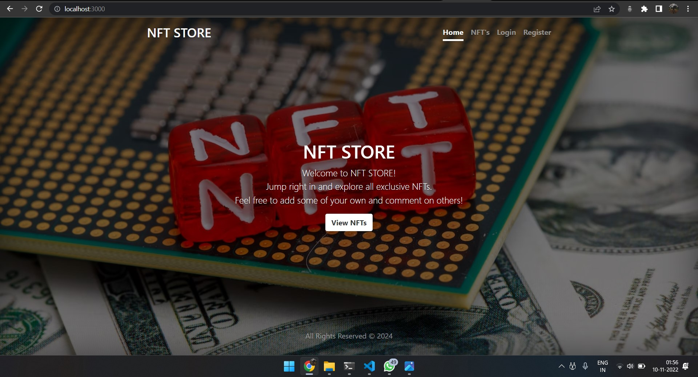
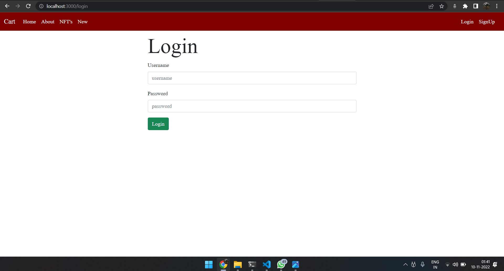
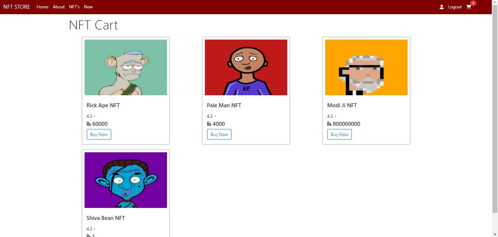

<h1 align="center">
    <b>NFT STORE Website Made With<br>ExpressJs & Node.js using MongoDB </b> 
<br>
</h1>


<p align="center">
  <a href="/LICENSE"></a>
</p>


## What is this for?
A NFT Website with Login system made with Node.js Framework using MongoDB(Atlas) as the data store, Express as the routing system, Body-parser as the parser for webpage, Express-session used  to track the user's session and of course Mongoose to make interacting with Mongo from Node easy.


### •Home page:
Allows the user to create their account by filling Email, Username & Password.



### •Login page:
If the user has already registered on the app, user can login by username and password.



### •NFT CART:
The user is logged in with a simple profile with the user's username and password <br>displayed with a session Logout button, and all the NFTs.




### DataBase:
Here we use **[MongoDB Atlas(Cloud)](https://www.mongodb.com/cloud/atlas)** as the database. Here we have two collection created, named as:
- users.
- sessions.


<br>
<br>
<br>

## Prerequisites
Tools that we need to run this app:

- ***[Node.js](https://nodejs.org/en/)***
- ***[Node Package Manager](https://www.npmjs.com/get-npm)***
- ***[MongoDB (Atlas)](https://www.mongodb.com/cloud/atlas)***

## Steps to run Website on Local Machine
```
1.First clone the project by Using Command git clone and paste the Link from code button.
2.After Cloning change your Current Directory to project Directory us (cd <directory name>).
3.Run command npm install
4.Then run npm start
```


